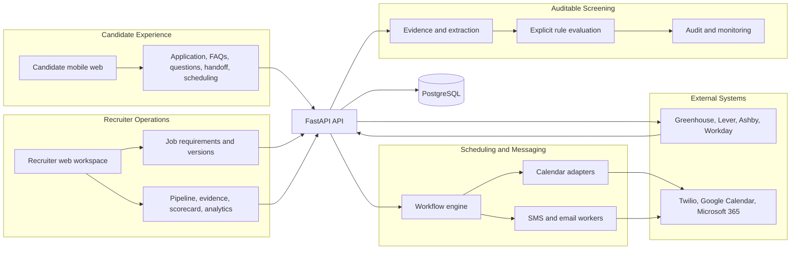
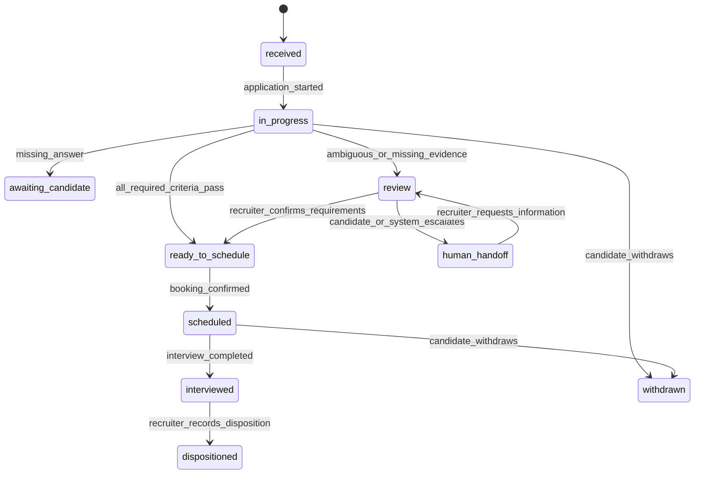
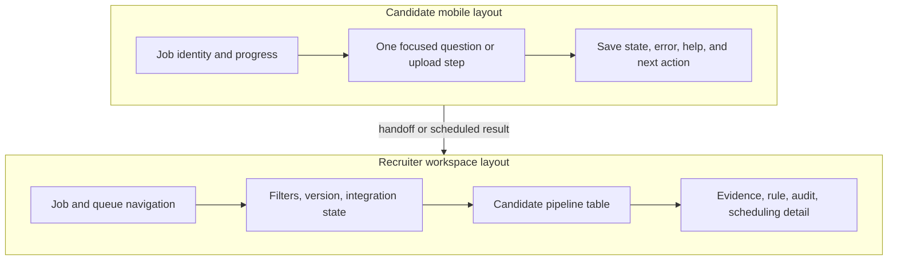

# Recruiting Screening and Scheduling Agent

## Header

| Field | Value |
|---|---|
| Document | Product requirements document |
| Product | Recruiting Screening and Scheduling Agent |
| One-line pitch | Screens and schedules high-volume job candidates against explicit, auditable requirements for recruiters. |
| Status | Greenfield |
| Date | 2026-08-04 |
| Author | OpenCode |
| Target delivery | 4 to 6 weeks |
| Existing codebase | None; target directory is empty |
| Has a UI | Yes |
| Verified product source | `D:\ARC Automation Service\Project list.md`, section 4 |
| Source policy | Section 4 and the supplied task inputs are the only verified product sources. |

### Source labels

| Label | Meaning |
|---|---|
| Verified | Stated in section 4 of `Project list.md` or supplied directly in the task. |
| `[inferred]` | A proposed product or implementation decision needed to make the MVP buildable; not a source fact. |
| `[uncertain]` | An unverified provider capability, version, benchmark, legal interpretation, or external claim. |
| Not specified | Deliberately not invented, including team size, budget, and external deadline. |

## Project Summary

The Recruiting Screening and Scheduling Agent is a recruiter-controlled workflow for high-volume hiring. It collects candidate information through a mobile application flow, parses resumes, asks knockout questions, answers approved FAQs, evaluates explicit job requirements, schedules and reschedules interviews, sends reminders, synchronizes the ATS boundary, and presents scorecards and funnel analytics.

The product is intentionally not an opaque hiring engine. A recruiter authors and publishes criteria, can inspect evidence for every result, owns final disposition, handles ambiguity and handoff, and reviews accessibility and adverse-outcome signals. The MVP is bounded by Next.js, FastAPI, PostgreSQL, a workflow engine, SMS and email workers, and the listed ATS, messaging, and calendar integrations.

### Verified product basis

| Verified source statement | PRD consequence |
|---|---|
| Buyers include staffing agencies, retail chains, hospitality businesses, healthcare employers, logistics companies, call centers, and high-volume recruiters. | Optimize repetitive screening and interview coordination; do not optimize executive recruitment. |
| Recruiters spend time on basic qualifications, repetitive questions, scheduling, and rescheduling. | Automate collection and coordination while exposing decision logic. |
| Features include mobile application, knockout questions, resume parsing, FAQs, scheduling, reminders, rescheduling, handoff, ATS synchronization, scorecards, and funnel analytics. | All appear in the MVP requirements or a named build phase. |
| Agency-quality behavior requires explicit requirements, human responsibility, logged criteria, accessibility, and adverse-outcome monitoring. | These are release gates, not optional polish. |
| The source demo uses 500 retail applications and checks work authorization, availability, location, experience, and interview slots. | This is the primary scale and end-to-end demonstration. |

### MVP boundary

| In scope | Deferred or excluded |
|---|---|
| One job configuration with versioned requirements, candidate application, resume extraction, FAQs, structured screening, handoff, scheduling, reminders, rescheduling, scorecard, ATS adapter boundary, audit, bias monitoring, and funnel analytics. | Autonomous hiring decisions, opaque ranking, executive recruitment, offers, compensation, onboarding, payroll, background checks, sourcing, outbound campaigns, video interviewing, voice interviewing, and recruiting marketing videos. |
| Responsive web for candidate and recruiter surfaces. | Native iOS or Android applications. |
| Adapter contracts for Greenhouse, Lever, Ashby, Workday, Twilio, Google Calendar, and Microsoft 365. | A claim that providers share endpoints, permissions, webhook guarantees, rate limits, or scheduling semantics; these are `[uncertain]`. |
| Human-review queue for incomplete, conflicting, inaccessible, low-confidence, or adverse-outcome cases. | Automated rejection that bypasses an accountable recruiter. |

## Table of Contents

- [Header](#header)
- [Project Summary](#project-summary)
- [Table of Contents](#table-of-contents)
- [Product Overview](#product-overview)
- [Technology Stack](#technology-stack)
- [System Architecture](#system-architecture)
- [Core Design: Auditable Screening and Scheduling](#core-design-auditable-screening-and-scheduling)
- [Design System](#design-system)
- [Build Plan](#build-plan)
- [Open Decisions & Future Scope](#open-decisions--future-scope)
- [Appendix: References](#appendix-references)

## Product Overview

### Product promise

> The agent reduces repetitive recruiter work without hiding why a candidate reached a screening result or who remains responsible for the decision.

### Actors and responsibility

| Actor | Allowed actions | Responsibility boundary |
|---|---|---|
| Candidate | Enter or correct data, upload a resume, answer questions, read approved FAQs, select or change a slot, request human help, opt out. | Cannot edit recruiter requirements or audit records. |
| Recruiter | Author and publish criteria, inspect evidence, answer handoffs, override with a reason, schedule, reschedule, review scorecards, finalize disposition, review analytics. | Owns final disposition and must not treat an opaque score as the decision. |
| Human reviewer | Resolve ambiguity, correct evidence, handle accessibility or language requests, investigate monitoring alerts. | Must record a reason for override or disposition. |
| Agent | Ask configured questions, extract evidence, classify against explicit rules, answer approved FAQs, propose next actions, create tasks. | Cannot change criteria, invent evidence, send unapproved content, or finalize hire/reject. |
| Workflow engine | Orchestrate durable steps, retries, reminders, and state transitions. | Cannot bypass authorization or turn retry failure into disposition. |
| System administrator [inferred] | Configure access, credentials, templates, retention settings, and monitoring access. | Cannot silently rewrite historical versions or erase audit history. |

### Product principles

| Principle | Required behavior |
|---|---|
| Explicit over opaque | Each criterion has a stable ID, operator, expected value, source, version, and explanation. |
| Assist, do not decide | The system recommends a next action; an authorized recruiter finalizes disposition. |
| Evidence before score | The scorecard shows answers, resume evidence, rule result, confidence, and conflicts. |
| Candidate dignity | The candidate can correct data, request a human, reschedule, and receive neutral status copy. |
| Safe failure | Ambiguity, missing data, worker failure, and provider failure become visible review or retry work. |
| Narrow scope | The MVP handles high-volume application screening and interview coordination only. |

### Goals and observable outcomes

| ID | Goal | Observable result |
|---|---|---|
| G-01 | Reduce repetitive recruiter screening work. | Recruiter reviews a structured requirement summary instead of manually reading every response. |
| G-02 | Make screening reconstructable. | Criterion result can be rebuilt from job version, evidence, rule, evaluator, and timestamp. |
| G-03 | Move eligible candidates to interview selection. | Candidate chooses an available slot or enters a handoff queue. |
| G-04 | Keep humans accountable. | Final disposition and overrides require recruiter identity and reason. |
| G-05 | Support the high-volume demo. | 500 retail applications retain status, events, and idempotency. |
| G-06 | Monitor unequal outcomes. | Authorized reviewers can segment funnels and investigate adverse-outcome flags. |

### Concrete failure behavior

- **Unreadable resume:** extraction records `unavailable`; missing experience becomes `review`, not an invented value or automatic rejection.
- **Ambiguous answer:** the criterion becomes `review`, the candidate can correct it, and a recruiter task is created.
- **Duplicate calendar callback:** the idempotency key and provider event identity reconcile the callback without creating a second active interview.
- **Provider or worker failure:** local state remains visible, a bounded retry is attempted when safe, and exhausted work becomes a recruiter or administrator task.
- **Inaccessible step or human request:** the candidate gets a manual-entry or handoff path, and automated screening pauses.

### Numeric success metrics

Targets marked `[inferred]` are release or controlled-demo targets, not external benchmarks.

| ID | Metric | Definition | Target |
|---|---|---|---|
| M-01 | Screening completion rate | Terminal screening results divided by applications started, excluding withdrawals. | At least 90% in the controlled demo [inferred]. |
| M-02 | Evidence coverage | Required criterion evaluations with valid evidence divided by required evaluations. | At least 95% for structured answers [inferred]. |
| M-03 | Duplicate interview rate | Duplicate active interview records per application. | 0 in acceptance tests. |
| M-04 | Booking success rate | Confirmed bookings divided by attempts with available slots. | At least 95% in mocked provider tests [inferred]. |
| M-05 | Message traceability | Messages with template, consent, and provider result divided by outbound messages. | 100%. |
| M-06 | Audit completeness | Decision-bearing changes with actor, version, timestamp, and required reason divided by changes. | 100%. |
| M-07 | Human disposition coverage | Final dispositions with a human actor divided by dispositioned applications. | 100%. |
| M-08 | ATS reconciliation rate | Internal and external statuses agreeing after sync divided by synced applications. | 100% in adapter contract tests. |
| M-09 | Accessibility defect count | Open release-blocking accessibility defects in the test matrix. | 0 at release. |
| M-10 | 500-application reconciliation | Applications represented in final event and funnel counts divided by source applications. | 100% for the retail demo. |
| M-11 | Adverse-outcome alert count | Configured monitoring flags by job version and criterion. | 0 unexplained flags at release; all flags investigated. |
| Q-01 | Qualitative observable behavior | In an observed review, the recruiter can state the selected criterion's evidence, rule, and next action without opening a raw event log. | Behavior is present in the review workflow. |

## Technology Stack

### MVP stack boundary

| Technology or integration | Requirement-specific justification | Version or capability status |
|---|---|---|
| Next.js | Provides the candidate mobile-responsive flow and recruiter pipeline, screening explanation, scheduling, scorecard, and analytics UI required by the source. | Listed stack; exact version `[uncertain]`. |
| FastAPI | Provides typed API boundaries for job requirements, applications, evaluations, handoff, scheduling, audit, and adapter operations. | Listed stack; exact version and deployment shape `[uncertain]`. |
| PostgreSQL | Stores immutable requirement versions, candidate evidence, evaluations, interviews, work items, scorecards, funnel events, and audit records. | Listed stack; exact version and hosting `[uncertain]`. |
| Workflow engine | Makes resume parsing, screening, reminders, retries, rescheduling, and synchronization durable and idempotent. | Listed stack; exact engine and capabilities `[uncertain]`. |
| SMS workers | Send confirmations, reminders, handoff acknowledgements, and reschedule notices while recording consent and provider outcomes. | Listed stack; provider behavior `[uncertain]`. |
| Email workers | Provide the email channel for confirmations, reminders, handoffs, and delivery tracing. | Listed stack; provider behavior `[uncertain]`. |
| Greenhouse adapter | Synchronizes the permitted application, status, note, and interview boundary. | Listed integration; exact tenant API, scopes, and write behavior `[uncertain]`. |
| Lever adapter | Synchronizes the permitted application, status, note, and interview boundary. | Listed integration; exact tenant API, scopes, and write behavior `[uncertain]`. |
| Ashby adapter | Synchronizes the permitted application, status, note, and interview boundary. | Listed integration; exact tenant API, scopes, and write behavior `[uncertain]`. |
| Workday adapter | Preserves an adapter boundary for the listed enterprise ATS integration without assuming tenant parity. | Listed integration; endpoint, object model, auth, and writes `[uncertain]`. |
| Twilio adapter | Sends SMS and maps delivery outcomes to message work items where available. | Listed integration; sender, callbacks, regional behavior, and consent handling `[uncertain]`. |
| Google Calendar adapter | Fetches slots and creates, updates, or cancels interviews. | Listed integration; scopes, organizer semantics, conflicts, and quotas `[uncertain]`. |
| Microsoft 365 adapter | Fetches slots and creates, updates, or cancels interviews. | Listed integration; permissions, organizer semantics, conflicts, and quotas `[uncertain]`. |

## System Architecture

### Bounded-context diagram [inferred]



### Request-to-response communication flow

1. The candidate or recruiter sends a request to the Next.js UI; the UI includes the application, job, actor, or idempotency context.
2. Next.js calls FastAPI; FastAPI authenticates the actor where required, validates the typed request, and creates a correlation ID.
3. FastAPI reads the immutable job requirement version and writes the application, evidence, work item, or human action to PostgreSQL.
4. For durable work, FastAPI enqueues a workflow activity and returns an accepted response with the current state and correlation ID; short deterministic reads return data directly.
5. The workflow activity extracts evidence, evaluates explicit rules, calls an adapter, or invokes an SMS/email worker; each side effect uses an idempotency key.
6. The worker persists the result, appends an audit event, and emits the next internal state; transient failures retry only when the operation is safe.
7. Provider callbacks are normalized through the relevant adapter, reconciled against the idempotency key, and ignored when already applied.
8. FastAPI returns or streams the current state to Next.js; the UI shows evidence, status, retry, handoff, or scheduling action without claiming an unconfirmed provider result.

### Proposed directory tree [inferred]

```text
Recruiting_Screening_and_Scheduling_Agent/
  web/
    app/layout.tsx                         # Shared Next.js shell and accessibility landmarks.
    app/apply/[jobSlug]/page.tsx           # Candidate application and screening entry.
    app/apply/[jobSlug]/schedule/page.tsx  # Candidate slot selection and rescheduling.
    app/recruiter/jobs/page.tsx            # Recruiter job list and integration health.
    app/recruiter/jobs/[jobId]/requirements/page.tsx # Requirement editor and publish preview.
    app/recruiter/jobs/[jobId]/pipeline/page.tsx      # Candidate pipeline and handoff queue.
    app/recruiter/applications/[id]/page.tsx           # Evidence, scheduling, audit, and disposition.
    app/recruiter/jobs/[jobId]/analytics/page.tsx      # Funnel and adverse-outcome monitoring.
    components/RequirementMatrix.tsx      # Criterion result, evidence, and explanation display.
    components/SlotPicker.tsx             # Time-zone-aware slot selection states.
    lib/api.ts                            # Typed browser-to-FastAPI client.
  api/
    main.py                               # FastAPI application entry point.
    routes/jobs.py                         # Job and requirement-version endpoints.
    routes/applications.py                 # Candidate, screening, handoff, and disposition endpoints.
    routes/scheduling.py                   # Slot, booking, and rescheduling endpoints.
    routes/audit.py                        # Authorized audit read endpoints.
    domain/models.py                       # Domain entities and status transitions.
    domain/rules.py                        # Deterministic criterion evaluation.
    services/evidence.py                   # Resume and answer evidence orchestration.
    services/authorization.py              # Actor and monitoring-view authorization.
    repositories/postgres.py               # PostgreSQL persistence boundary.
  workers/
    workflows/screen_application.py        # Durable extraction and evaluation workflow.
    workflows/book_interview.py            # Idempotent reservation and release workflow.
    sms_worker.py                          # SMS template, consent, retry, and provider result handling.
    email_worker.py                        # Email template, consent, retry, and provider result handling.
  integrations/
    ats/base.py                            # Shared ATS adapter interface.
    ats/greenhouse.py                      # Greenhouse mapping implementation.
    ats/lever.py                           # Lever mapping implementation.
    ats/ashby.py                           # Ashby mapping implementation.
    ats/workday.py                         # Workday mapping implementation.
    calendar/base.py                       # Shared calendar adapter interface.
    calendar/google.py                     # Google Calendar mapping implementation.
    calendar/microsoft365.py               # Microsoft 365 mapping implementation.
    messaging/twilio.py                   # Twilio SMS mapping implementation.
  db/
    migrations/001_core.sql                # Jobs, applications, evidence, interviews, and work items.
    migrations/002_audit.sql               # Append-only audit and monitoring event tables.
  contracts/
    domain.ts                              # Shared status, entity, and event types.
    http.ts                                # Request and response contracts.
  tests/
    contracts/                             # API and adapter contract tests.
    workflows/                             # Retry, idempotency, and state transition tests.
    accessibility/                         # Keyboard, responsive, and assistive-technology checks.
    e2e/retail_500.py                      # Source scenario replay and count reconciliation.
```

## Core Design: Auditable Screening and Scheduling

### Decision and control model

| Control point | Required human action |
|---|---|
| Requirement publication | Recruiter reviews and publishes a version before screening. |
| Ambiguous answer | Recruiter reviews evidence or contacts the candidate; no automatic rejection. |
| Missing or conflicting resume evidence | Recruiter resolves evidence or requests correction. |
| Candidate human request | Recruiter receives a handoff task; automated screening messaging pauses. |
| Final disposition | Recruiter selects disposition and records a reason. |
| Adverse-outcome alert | Authorized reviewer investigates segment and criterion behavior before changing configuration. |
| Integration failure | Recruiter retries, uses a manual scheduling path, or records a handoff. |

### Functional contract: requirements

| ID | Requirement | Priority | Acceptance condition |
|---|---|---|---|
| REQ-JOB-01 | Create job with title, location policy, description, FAQ content, interview types, and application settings. | Must | Draft saves and reopens. |
| REQ-JOB-02 | Define each screening criterion explicitly and block configured prohibited or undisclosed attributes [inferred]. | Must | Stable ID, label, type, operator, expected value, required flag, and explanation exist; blocked attempts are logged. |
| REQ-JOB-03 | Support boolean, enum, number, duration, text-review, location, availability, work-authorization, and experience types. | Must | Unsupported type cannot publish. |
| REQ-JOB-04 | Mark knockout criteria and candidate-facing wording. | Must | Wording is previewed and stored in the job version. |
| REQ-JOB-05 | Publish immutable requirement versions. | Must | Later edits create a new version; old screening retains its version. |
| REQ-CAN-01 | Candidate opens a mobile-responsive application, submits contact data, and uploads an optional resume. | Must | Flow works at 320 CSS px without horizontal scrolling. |
| REQ-CAN-02 | Parse resume into structured evidence with source spans or page references where available. | Must | Uncertain extraction is labeled and routed to review. |
| REQ-CAN-03 | Ask configured knockout and follow-up questions in published order. | Must | Questions cannot be silently skipped. |
| REQ-CAN-04 | Answer only recruiter-approved FAQs. | Must | Unsupported answer falls back to human handoff. |
| REQ-CAN-05 | Produce `pass`, `fail`, `review`, or `not_evaluated` per criterion. | Must | Result includes evidence, rule, version, confidence, and timestamp. |
| REQ-CAN-06 | Allow candidate correction, neutral status, and human handoff before disposition. | Must | New evidence is stored; screening pauses on handoff; no hidden score or irreversible automatic rejection is shown. |
| REQ-SCH-01 | Configure interview type, duration, time zone, eligible calendars, and availability window. | Must | Configuration is versioned with the job. |
| REQ-SCH-02 | Show slots and book idempotently. | Must | Repeated callback cannot create duplicate interviews. |
| REQ-SCH-03 | Reschedule with replacement-first semantics. | Must | Old reservation releases only after replacement succeeds or recovery is recorded. |
| REQ-SCH-04 | Send SMS and email confirmations and reminders. | Must | Template, consent, provider result, and retry state are stored. |
| REQ-SCH-05 | Support opt-out, visible delivery failure, and manual scheduling or scheduling handoff. | Must | Future non-essential sends are suppressed; failure creates retry or handoff work; manual action has actor and reason. |
| REQ-REC-01 | Show recruiter pipeline, evidence matrix, versioned scorecard, scheduling, audit, filters, and handoff queue. | Must | Counts and rows link to filters for review, failed work, handoff, missing evidence, and scheduled candidates. |
| REQ-REC-02 | Allow safe retry, authorized export, override, and disposition only with actor and reason. | Must | Retry is idempotent; export is access logged and secret-free; missing reason is rejected. |
| REQ-ANA-01 | Show funnel by job version and date range. | Must | Denominator and timestamp definition are visible. |
| REQ-ANA-02 | Compare automated recommendation, human override, and final outcome. | Must | These are separate counts. |
| REQ-ANA-03 | Segment approved monitoring attributes and flag adverse outcomes. | Must | Alert includes segment, stage, denominator, comparison, and data limits. |

### Typed state and entity schemas

```typescript
type ApplicationStatus =
  | "received" | "in_progress" | "awaiting_candidate" | "review"
  | "ready_to_schedule" | "scheduled" | "interviewed"
  | "human_handoff" | "withdrawn" | "dispositioned";

type CriterionResult = "pass" | "fail" | "review" | "not_evaluated";
type EvidenceSource = "candidate_answer" | "resume" | "recruiter_override" | "integration";
type WorkStatus = "queued" | "running" | "succeeded" | "retryable" | "failed" | "cancelled";
type Disposition = "advance" | "hold" | "decline" | "withdrawn";

interface Criterion {
  id: string;
  label: string;
  type: "boolean" | "enum" | "number" | "duration" | "text_review"
    | "location" | "availability" | "work_authorization" | "experience";
  operator: "equals" | "one_of" | "greater_than_or_equal" | "contains" | "overlaps";
  expectedValue: unknown;
  required: boolean;
  knockout: boolean;
  candidateQuestion: string;
  explanation: string;
}

interface JobRequirementVersion {
  id: string;
  jobId: string;
  version: number;
  status: "draft" | "published" | "retired";
  publishedBy: string | null;
  publishedAt: string | null;
  criteria: Criterion[];
}

interface CandidateApplication {
  id: string;
  jobId: string;
  jobRequirementVersionId: string;
  externalApplicationId: string | null;
  contact: { name: string; email: string | null; phone: string | null };
  status: ApplicationStatus;
  consent: { sms: "granted" | "denied" | "unknown"; email: "granted" | "denied" | "unknown" };
  createdAt: string;
  updatedAt: string;
}

interface Evidence {
  id: string;
  applicationId: string;
  criterionId: string | null;
  source: EvidenceSource;
  value: unknown;
  sourceReference: { kind: "answer" | "document_span" | "event"; id: string };
  confidence: number | null;
  extractionStatus: "complete" | "uncertain" | "unavailable" | "corrected";
  createdAt: string;
}

interface CriterionEvaluation {
  id: string;
  applicationId: string;
  requirementVersionId: string;
  criterionId: string;
  result: CriterionResult;
  evidenceIds: string[];
  ruleExpression: string;
  explanation: string;
  evaluatedAt: string;
  evaluator: "rule_engine" | "human";
}
```

### Scheduling, work, and audit schemas

```typescript
interface Interview {
  id: string;
  applicationId: string;
  interviewTypeId: string;
  calendarProvider: "google_calendar" | "microsoft_365" | "manual";
  externalEventId: string | null;
  startAt: string;
  endAt: string;
  timeZone: string;
  status: "held" | "confirmed" | "reschedule_requested" | "cancelled" | "completed";
  bookingKey: string;
}

interface WorkItem {
  id: string;
  kind: "parse_resume" | "evaluate_screen" | "send_message" | "sync_ats"
    | "fetch_slots" | "book_interview" | "release_slot" | "human_handoff";
  idempotencyKey: string;
  status: WorkStatus;
  attempts: number;
  lastErrorCode: string | null;
  nextAttemptAt: string | null;
}

interface AuditEvent {
  id: string;
  occurredAt: string;
  actorType: "candidate" | "recruiter" | "admin" | "agent" | "worker" | "integration";
  actorId: string | null;
  action: string;
  entityType: string;
  entityId: string;
  before: unknown | null;
  after: unknown | null;
  reason: string | null;
  correlationId: string;
  sourceVersion: string;
}
```

### Service interfaces

```typescript
interface AtsAdapter {
  provider: "greenhouse" | "lever" | "ashby" | "workday";
  importApplication(input: ImportApplicationInput): Promise<ImportApplicationResult>;
  writeApplicationUpdate(input: ApplicationUpdateInput): Promise<ProviderWriteResult>;
  healthCheck(): Promise<HealthResult>;
}

interface CalendarAdapter {
  provider: "google_calendar" | "microsoft_365" | "manual";
  listSlots(input: SlotQuery): Promise<Slot[]>;
  reserve(input: ReservationInput): Promise<ReservationResult>;
  release(input: ReleaseInput): Promise<ReleaseResult>;
  updateInterview(input: InterviewUpdateInput): Promise<ProviderWriteResult>;
}

interface MessageAdapter {
  channel: "sms" | "email";
  send(input: MessageInput): Promise<MessageResult>;
}
```

### HTTP contracts

```http
POST /api/jobs/{jobId}/requirement-versions
Content-Type: application/json

{
  "criteria": [{
    "label": "Work authorization",
    "type": "work_authorization",
    "operator": "equals",
    "expectedValue": true,
    "required": true,
    "knockout": true,
    "candidateQuestion": "Are you authorized to work in the job location?",
    "explanation": "This role requires current work authorization."
  }]
}

201 Created
{ "id": "jrv_123", "status": "draft", "version": 1 }
```

```http
POST /api/applications/{applicationId}/screen
Idempotency-Key: screen:{applicationId}:{requirementVersionId}

200 OK
{
  "applicationId": "app_123",
  "requirementVersionId": "jrv_123",
  "results": [{
    "criterionId": "crit_work_auth",
    "result": "pass",
    "evidenceIds": ["ev_456"],
    "explanation": "Candidate answer matched the configured requirement."
  }],
  "nextAction": "ready_to_schedule"
}
```

```http
POST /api/applications/{applicationId}/disposition
Content-Type: application/json

{ "disposition": "advance", "reason": "Reviewed evidence and confirmed availability with candidate." }

Authorization: recruiter session required
409 Conflict
{ "code": "HUMAN_REASON_REQUIRED", "message": "A reason is required." }
```

### State machine



### Real-input-to-output trace A: 500 retail applications

**Input scenario:** 500 retail applications arrive for a published job. The five configured requirements are work authorization, availability, location, experience, and interview slots. A sample candidate submits a resume, answers all questions, and selects a slot.

```typescript
interface RetailApplicationInput {
  sourceApplicationId: "retail-0001";
  jobRequirementVersionId: "retail-job-v1";
  answers: {
    workAuthorization: true;
    availability: "weekends";
    location: "Chicago";
    experienceYears: 2;
  };
  resume: { fileId: "resume-0001"; format: "pdf" };
  selectedSlot: { startAt: "2026-08-12T14:00:00Z"; timeZone: "America/Chicago" };
}
```

| Step | Input to output behavior |
|---:|---|
| 1 | ATS adapter maps `retail-0001` to an internal application and de-duplicates the event. |
| 2 | Resume worker extracts experience and location evidence with references; uncertain extraction becomes `review`. |
| 3 | Candidate answers become versioned evidence records with consent context. |
| 4 | Rule evaluation returns one result for each of the five explicit criteria. |
| 5 | All `pass` results produce `ready_to_schedule`; any `review` produces a recruiter task instead. |
| 6 | Calendar adapter reserves the selected slot with a booking key; repeated callbacks are ignored. |
| 7 | Message workers send confirmation and reminder templates with consent and provider result. |
| 8 | Recruiter inspects the matrix, scorecard, scheduling record, and audit events, then records a disposition and reason. |
| 9 | Funnel aggregation represents all 500 source applications and preserves job-version and stage denominators. |

```typescript
interface RetailApplicationOutput {
  applicationId: "app-retail-0001";
  status: "scheduled";
  evaluations: Array<{
    criterionId: "work_authorization" | "availability" | "location" | "experience" | "interview_slot";
    result: "pass";
    evidenceIds: string[];
    requirementVersionId: "retail-job-v1";
  }>;
  interview: { status: "confirmed"; bookingKey: string; timeZone: "America/Chicago" };
  nextHumanAction: "recruiter_disposition";
  auditEventIds: string[];
}
```

**Trace A invariants:** no result without a requirement version; no final disposition without a human actor and reason; no automatic disposition from uncertain extraction; no duplicate interview; every message has template and consent context.

### Real-input-to-output trace B: incomplete evidence and rescheduling

**Input scenario:** A candidate uploads an unreadable resume, gives an ambiguous availability answer, requests a human, and later asks to reschedule an existing interview.

```typescript
interface ExceptionInput {
  applicationId: "app-456";
  resume: { fileId: "resume-unreadable"; format: "pdf" };
  availabilityAnswer: "sometimes available";
  priorInterview: { id: "int-789"; status: "confirmed" };
  request: "human_handoff_then_reschedule";
}
```

| Step | Input to output behavior |
|---:|---|
| 1 | Extraction records `unavailable` and creates no missing experience value. |
| 2 | The answer is stored as raw evidence and normalized to `review`. |
| 3 | Human request creates a handoff work item and pauses automated screening. |
| 4 | Recruiter requests a corrected resume or confirms evidence manually; the correction is linked to actor and source. |
| 5 | Reschedule validates the application and interview IDs, then reserves a replacement slot before releasing the old one. |
| 6 | Successful replacement updates the interview, releases the old slot, and sends one updated confirmation. |
| 7 | Recruiter records a human disposition with reason; audit records capture the exception path. |

```typescript
interface ExceptionOutput {
  applicationId: "app-456";
  status: "human_handoff" | "review" | "scheduled";
  evaluation: { criterionId: "availability"; result: "review"; evidenceIds: string[] };
  handoff: { status: "queued"; reason: "candidate_requested_human" };
  interview: { oldId: "int-789"; replacementId: string; status: "confirmed" };
  automatedDisposition: null;
  requiredHumanAction: "review_and_disposition";
}
```

### Audit and monitoring controls

| Event | Required fields |
|---|---|
| Requirement publication | Actor, job, version, before/after, timestamp, and change reason where applicable. |
| Candidate answer | Candidate, question version, value or redacted value, timestamp, and consent context. |
| Resume extraction | Application, file ID, extractor version `[uncertain]`, evidence IDs, status, and timestamp. |
| Criterion evaluation | Requirement version, criterion, evidence IDs, result, rule expression, evaluator, and timestamp. |
| Human override or disposition | Actor, before/after, reason, timestamp, and correlation ID. |
| Message | Channel, template version, recipient reference, consent state, provider result, and timestamp. |
| Calendar change | Actor or work item, interview, old/new slot, provider result, and idempotency key. |
| ATS sync | Adapter, external reference, payload category, result, correlation ID, and timestamp. |
| Access | Actor, resource, action, result, timestamp, and correlation ID. |

Monitoring attributes are access-controlled, never passed to criterion evaluation, and separated from screening criteria. Stage conversion, review rate, override rate, adverse-outcome flags, and monitoring-data completeness are shown with numerator, denominator, date range, missingness, and data sufficiency. Small or incomplete segments are labeled insufficient. Each alert has an owner, investigation status, note, and resolution event. Thresholds and statistical methods are `[uncertain]`; the product does not claim legal sufficiency.

### Integration and retry rules

| Case | Required behavior |
|---|---|
| Auth failure | Mark provider degraded, preserve application data, create a task, and expose retry. |
| Rate limit | Honor provider response when available `[uncertain]`; use bounded retry `[inferred]`; keep candidate state visible. |
| Malformed payload | Store sanitized error, reject only the event, and create review work. |
| Duplicate event | Return the prior internal result using provider event ID or idempotency key. |
| Provider outage | Preserve local intent and allow manual handoff. |
| Partial write | Reconcile by read-after-write when available `[uncertain]`; show `sync_pending`. |
| Resume extraction | Retry transient worker failure; invalid content becomes review. |
| Booking | Reconcile before retry; terminal failure becomes manual scheduling work. |
| ATS write | Retry an idempotent update and show `sync_pending` until reconciled. |

## Design System

### Design principles

| Principle | UI rule |
|---|---|
| Evidence is primary | Put criterion, source evidence, rule, evaluator, and explanation next to the result. |
| Human action is explicit | Use named actions such as `Review`, `Request correction`, `Override with reason`, and `Finalize disposition`. |
| Candidate progress is calm | Show saved state, next step, time zone, and handoff path without exposing an opaque score. |
| Failure is recoverable | Every error shows state, reason, safe retry, or human route. |
| Accessible status | Never communicate pass, review, failure, or booking state with color alone. |
| Dense but legible | Use tables for recruiter throughput; use stacked cards for mobile candidates. |

### CSS color tokens

```css
:root {
  --color-ink: #18212f; /* Intent: primary readable text for decisions and instructions. */
  --color-muted: #526174; /* Intent: secondary metadata without becoming the only status signal. */
  --color-surface: #ffffff; /* Intent: candidate forms and recruiter evidence panels. */
  --color-canvas: #f4f6f9; /* Intent: low-contrast page background behind work areas. */
  --color-primary: #303f9f; /* Intent: recruiter navigation and primary actions. */
  --color-primary-strong: #202c76; /* Intent: keyboard focus and pressed primary actions. */
  --color-success: #17663a; /* Intent: pass and confirmed states paired with text/icon. */
  --color-warning: #855500; /* Intent: review, uncertainty, and pending work paired with text/icon. */
  --color-danger: #a12622; /* Intent: failed work and validation errors paired with text/icon. */
  --color-border: #cbd3df; /* Intent: field, table, and evidence separation. */
  --color-focus: #0b63ce; /* Intent: visible 3px focus ring on every interactive control. */
}
```

### Typography scale

| Token | Size and line height [inferred] | Use |
|---|---|---|
| `--type-display` | 32px / 40px | Recruiter page title and candidate completion state. |
| `--type-heading` | 24px / 32px | Major panel and job title. |
| `--type-subheading` | 20px / 28px | Requirement group and interview section. |
| `--type-body` | 16px / 24px | Candidate copy, form labels, explanations, table cells. |
| `--type-small` | 14px / 20px | Metadata and timestamps; never sole status carrier. |
| `--type-code` | 13px / 20px | IDs, correlation IDs, and rule expressions. |
| Font family | System sans stack | Readability and no unverified font dependency. |

### Layout diagram



### Information architecture

| Route [inferred] | User | Purpose |
|---|---|---|
| `/apply/{jobSlug}` | Candidate | Application, questions, FAQs, handoff, and scheduling entry. |
| `/recruiter/jobs` | Recruiter | Jobs, pipeline entry, and integration health. |
| `/recruiter/jobs/{jobId}/requirements` | Recruiter | Draft, validate, preview, and publish criteria. |
| `/recruiter/jobs/{jobId}/pipeline` | Recruiter | Candidate rows, filters, and handoff queue. |
| `/recruiter/applications/{applicationId}` | Recruiter | Evidence, evaluation, messages, scheduling, audit, and disposition. |
| `/recruiter/jobs/{jobId}/analytics` | Recruiter or reviewer | Funnel, overrides, and adverse-outcome monitoring. |

### Accessibility requirements

| ID | Requirement | Verification |
|---|---|---|
| A11Y-01 | Candidate and recruiter flows operate with keyboard only. | Keyboard walkthrough. |
| A11Y-02 | Inputs have programmatic labels and associated errors. | Automated scan plus screen-reader walkthrough; tool `[uncertain]`. |
| A11Y-03 | Focus remains visible and logical after validation, modal, and route changes. | Manual interaction test. |
| A11Y-04 | Status uses text and icon, not color alone. | Visual and DOM review. |
| A11Y-05 | Candidate flow works at 320px width and zoomed text [inferred]. | Responsive test matrix. |
| A11Y-06 | Dynamic screening and scheduling updates are announced. | Live-region review with assistive technology. |
| A11Y-07 | Resume upload has a manual data-entry path. | Continue when extraction is unavailable. |
| A11Y-08 | Dates show local time zone and canonical time zone. | Test at two configured time zones [inferred]. |
| A11Y-09 | Human assistance is available without completing an inaccessible step. | Handoff action remains available. |

### Micro-interactions

| Interaction | Feedback | Safety or accessibility rule |
|---|---|---|
| Save candidate answer | Inline `Saved` state with timestamp. | Do not clear focus or erase entered text. |
| Resume upload | Progress, extraction state, and manual-entry fallback. | Never imply extraction succeeded before evidence is stored. |
| Criterion review | Expand evidence and rule explanation. | Keep result text visible; color is supplemental. |
| Override | Modal asks for reason and shows before/after. | Focus enters modal and returns to triggering control. |
| Slot selection | Selected state, time zone, then `Booking` state. | Disable duplicate submit while request is active. |
| Reschedule | Replacement slot first, old slot retained until success. | Explain conflict and offer recruiter handoff. |
| Handoff | Confirmation with expected next action and neutral status. | Stop automated screening messages after request. |
| Provider failure | Persistent badge, reason, retry, and manual route. | Do not hide failure behind a toast only. |
| Audit expansion | Before/after diff, actor, reason, correlation ID. | Redact secrets and preserve readable order. |

## Build Plan

The supplied timeline is 4 to 6 weeks. The plan uses four phases; team size, budget, and external deadline remain unspecified.

### Phase 1: Foundation and explicit requirements, Week 1

**Unchecked implementation tasks:**

- [ ] Create the Next.js candidate and recruiter shell.
- [ ] Create FastAPI job and requirement-version endpoints.
- [ ] Create PostgreSQL tables for jobs, criteria, versions, applications, and actors.
- [ ] Implement draft, validation, publish, and immutable-version rules.
- [ ] Add candidate link and generated-question preview.
- [ ] Add typed HTTP contracts and authorization boundary [inferred].

**Demoable output:** Recruiter publishes a retail job with work authorization, availability, location, experience, and interview-slot criteria; candidate opens the mobile question flow.

**Exit checks:** Published version is immutable; unsupported criterion cannot publish; candidate-facing wording matches preview.

### Phase 2: Screening and explainability, Weeks 2-3

**Unchecked implementation tasks:**

- [ ] Implement candidate contact, resume upload, and structured answer capture.
- [ ] Implement resume extraction boundary with evidence references and uncertainty states.
- [ ] Implement deterministic rule evaluation and `pass`, `fail`, `review`, `not_evaluated` results.
- [ ] Implement requirement matrix with evidence, rule, version, and evaluator.
- [ ] Implement approved FAQ lookup and unsupported-answer handoff.
- [ ] Implement candidate correction and recruiter handoff queue.
- [ ] Append audit events for answers, extraction, evaluation, and handoff.

**Demoable output:** Candidate submits a resume and answers; recruiter sees each criterion's evidence and explanation and can take over ambiguous cases.

**Exit checks:** No agent disposition path; uncertain evidence routes to review; audit completeness reaches 100% in tests.

### Phase 3: Scheduling, workers, and integration boundary, Week 4

**Unchecked implementation tasks:**

- [ ] Implement workflow work items, correlation IDs, retries, and idempotency keys.
- [ ] Implement calendar adapter interfaces and one test-double provider path.
- [ ] Implement SMS and email workers with templates, consent, and provider outcomes.
- [ ] Implement slot selection, replacement-first rescheduling, and duplicate callback handling.
- [ ] Implement ATS adapter interface and test doubles for Greenhouse, Lever, Ashby, and Workday.
- [ ] Add Twilio, Google Calendar, and Microsoft 365 mapping placeholders behind adapters.
- [ ] Add integration health, retry, `sync_pending`, and manual handoff UI.

**Demoable output:** A passing candidate selects a slot, receives confirmation, reschedules, and sees a provider failure become a recruiter task.

**Exit checks:** Duplicate callbacks create no duplicate interview; failed work remains visible and recoverable; provider claims are marked `[uncertain]` until verified.

### Phase 4: Analytics, monitoring, accessibility, and release hardening, Weeks 5-6

**Unchecked implementation tasks:**

- [ ] Implement funnel counts by job version, stage, date range, and denominator.
- [ ] Implement scorecard view and separate automated result, override, and final disposition counts.
- [ ] Implement authorized monitoring attributes, data completeness, and adverse-outcome flags.
- [ ] Add alert owner, investigation status, review note, and resolution event.
- [ ] Run keyboard, screen-reader, focus, responsive-width, and time-zone test matrix.
- [ ] Replay 500 retail applications and reconcile source, event, work-item, interview, and funnel counts.
- [ ] Record release evidence for human disposition, audit completeness, and accessibility gates.

**Demoable output:** Recruiter reviews the pipeline, scorecard, funnel, audit record, and adverse-outcome monitoring for 500 retail applications.

**Exit checks:** Must-have acceptance criteria pass; 0 release-blocking accessibility defects; 100% human disposition coverage in the controlled demo.

### Release acceptance scenarios

| ID | Given | When | Then |
|---|---|---|---|
| AC-01 | Five retail criteria are published. | Candidate submits passing answers. | Five versioned evaluations are created and the application becomes `ready_to_schedule`. |
| AC-02 | Resume is unreadable. | Screening runs. | No fabricated evidence is created; application enters `review` or `human_handoff`. |
| AC-03 | Candidate requests a human. | Request is submitted. | Automated screening pauses, recruiter task is created, and audit event is appended. |
| AC-04 | Slot callback is delivered twice. | Provider event is reconciled. | Exactly one active interview exists. |
| AC-05 | Candidate reschedules. | Replacement booking succeeds. | Old slot is released, new slot is confirmed, and message result is traced. |
| AC-06 | Recruiter overrides or dispositions. | Reason is missing. | API rejects change and creates no override or disposition event. |
| AC-07 | Requirement is edited after screening. | New version is published. | Existing result remains tied to old version until explicit re-screening. |
| AC-08 | Monitoring data is incomplete. | Reviewer opens a segment. | Counts, denominator, missingness, and limitation are shown without a conclusive claim. |
| AC-09 | Candidate uses keyboard and assistive technology. | Candidate completes or requests handoff. | Controls are reachable, labeled, announced, and usable without a mouse. |
| AC-10 | 500 applications follow the retail scenario. | Processing completes. | No application, audit event, or work item is silently lost. |

### Definition of done

- [ ] Source retail scenario runs from application intake through scheduled interview and human disposition.
- [ ] All must-have requirements have passing automated or recorded acceptance evidence.
- [ ] Every decision-bearing event has actor, version, timestamp, and required reason.
- [ ] No agent or worker can finalize hire or reject.
- [ ] Candidate flow supports keyboard use, visible focus, labels, correction, human handoff, and mobile width.
- [ ] Metrics have documented denominators and Q-01 is the only qualitative observable-behavior metric.
- [ ] Provider uncertainty is represented as an adapter limitation or test assumption, not a verified claim.

## Open Decisions & Future Scope

### Open decisions

| Decision | Recommendation | Reason | Status |
|---|---|---|---|
| First live ATS | Start with the provider for which tenant credentials are available; keep all four adapters contract-compatible. | Provider choice, auth scopes, object model, and write permissions are `[uncertain]`. | Verify during implementation. |
| First live calendar | Start with the provider for which calendar permissions are available; preserve Google Calendar and Microsoft 365 interfaces. | Availability, organizer behavior, conflict semantics, and quotas are `[uncertain]`. | Verify during implementation. |
| SMS sender and email sender | Use worker interfaces and test doubles before sender selection. | Sender configuration, delivery callbacks, regional behavior, and consent requirements are `[uncertain]`. | Verify before live messaging. |
| Requirement restrictions | Configure a publication blocklist for prohibited or undisclosed attributes [inferred]. | Criteria must remain explicit and auditable; exact policy taxonomy is not in the source. | Define before production. |
| Monitoring attributes | Allow only authorized, access-controlled attributes and keep them out of rule evaluation. | The source requires monitoring but does not specify taxonomy, threshold, or statistical method. | Define with product owner. |
| Retention and deletion | Make retention, deletion, and export policy configurable and audit policy changes. | Jurisdiction-specific obligations and retention period are `[uncertain]`. | Define before production. |
| Model and extractor versions | Store extractor/model version in evidence and audit records; exact versions are `[uncertain]`. | Reproducibility requires version linkage without inventing a vendor or model. | Verify at implementation. |
| Throughput and latency target | Instrument screening and scheduling latency, then set a target from observed 500-application runs. | No external benchmark or production SLA is provided. | Do not claim a target yet. |

### Implementation uncertainties

| Uncertainty | Required handling |
|---|---|
| Provider webhook and event guarantees | Treat callback identity as an adapter capability; reconcile duplicate events locally. |
| Provider rate limits and quotas | Honor returned limits when available `[uncertain]`; use bounded retry `[inferred]`; keep state visible. |
| Screen-reader test tooling | Use a documented manual and automated matrix; chosen tool is `[uncertain]`. |
| Legal interpretation of monitoring results | Display data limitations and investigation state; do not claim legal certification or sufficiency. |
| Team, budget, and external deadline | Remain unspecified; do not use them to expand or compress scope beyond the 4-6 week plan. |

### Aggressive out-of-scope boundary

- **Autonomous hire or reject:** Deferred because the source requires human responsibility and auditable criteria; the MVP only recommends next actions.
- **Opaque composite ranking:** Deferred because it would hide criterion evidence and create a decision path not supported by the source.
- **Executive recruiting workflow:** Deferred because the source explicitly says this product is weaker for executive recruitment.
- **Native mobile applications:** Deferred because responsive web satisfies the mobile application flow within the supplied timeline.
- **Sourcing and outbound campaign generation:** Deferred because the product starts from applications and focuses on screening and scheduling.
- **Offer generation, compensation, onboarding, payroll, and background checks:** Deferred because they are outside screening and interview coordination.
- **Video or voice interviewing:** Deferred because the listed MVP boundary is a mobile application flow with SMS and email workers.
- **Multi-language promise:** Deferred until a supported language set and review path are explicitly configured; unsupported language routes to handoff.
- **Production parity across every provider:** Deferred because exact endpoints, auth, quotas, and feature parity are `[uncertain]` and would threaten the 4-6 week boundary.
- **Legal or compliance certification:** Deferred because no jurisdiction, standard, citation, or certification is verified by the source.

## Appendix: References

### Source references

| Reference | Specific takeaway used |
|---|---|
| `D:\ARC Automation Service\Project list.md`, section 4, “Recruiting Screening and Scheduling Agent” | Verified target buyers, recruiter problem, required features, AI stack, technology stack, integrations, premium UI surfaces, agency-quality requirements, portfolio assets, demo scenario, industries, and executive-recruitment limitation. |
| Supplied task inputs dated 2026-08-04 | Verified project name, pitch, greenfield status, empty target directory, UI presence, 4-6 week timeline, author, and MVP stack/integration boundary. |

### Source-to-requirement map

| Source item | Concrete coverage |
|---|---|
| Mobile application flow | Candidate route, responsive layout, REQ-CAN-01, A11Y-05. |
| Knockout questions | `Criterion.knockout`, REQ-JOB-04, Phase 1, AC-01. |
| Resume parsing | Evidence schema, extraction uncertainty, REQ-CAN-02, AC-02. |
| Candidate FAQs | Approved FAQ lookup, fallback handoff, Phase 2. |
| Scheduling and reminders | Calendar adapter, workers, Trace A, REQ-SCH-01 through REQ-SCH-04. |
| Rescheduling | Replacement-first workflow, Trace B, AC-05. |
| Recruiter handoff | Human control points, handoff state, AC-03. |
| ATS synchronization | ATS interfaces and provider boundary for Greenhouse, Lever, Ashby, and Workday. |
| Scorecards and funnel analytics | Recruiter detail view, numeric metrics, Phase 4 dashboard. |
| Resume extraction, job-match classification, structured screening, conversational agent | Evidence, deterministic rule evaluation, approved FAQ boundary, and human control. |
| Bias monitoring and adverse outcomes | Authorized segmentation, completeness warnings, flags, owners, investigation state, and resolution events. |
| Explicit requirements and human responsibility | Immutable versions, evidence matrix, recruiter disposition, audit contract, and no agent disposition. |
| Accessibility | Keyboard, labels, focus, non-color status, mobile width, assistive announcements, manual entry, and handoff. |
| 500 retail applications | Trace A, M-10, Phase 4 replay, and AC-10. |

### Citation boundary

No external citations, vendor documentation, benchmarks, legal standards, API versions, pricing claims, or compliance certifications were used as verified evidence. Provider capabilities, thresholds, versions, tools, and legal interpretations are marked `[uncertain]` where they affect implementation.
