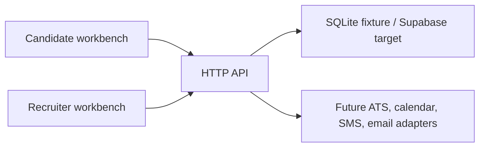

# Recruiting Screening and Scheduling Agent

Fixture-first recruiting workflow for job requirements, candidate applications, evidence-based screening, recruiter review, interview scheduling, reminders, callbacks, and pipeline analytics.

## Project status

The local slice is deterministic and SQLite-backed. A Supabase/PostgreSQL migration target and provider contracts are included, but authenticated workspace access, live ATS/calendar/messaging providers, retention controls, and production deployment remain unverified.

## Architecture



## Included capabilities

- Immutable job requirement versions and validation/publishing flow.
- Candidate application, evidence capture, screening, correction, and rerun.
- Recruiter review, human disposition, handoff, and pipeline filters.
- Interview slot lookup, scheduling, rescheduling, reminders, and callbacks.
- FAQ lookup, opt-out suppression, provider health, and deterministic replay.
- Static candidate/recruiter workbench with keyboard and narrow-mobile coverage.

## Quick start

Prerequisites: Python 3.11+, [`uv`](https://docs.astral.sh/uv/), and a modern browser. Node.js 20+ is needed for Playwright verification.

```powershell
.\start-dev.ps1
```

The launcher creates the disposable `.local/demo.sqlite3`, resets the fixture, and starts the API at `http://127.0.0.1:8104/`.

For the direct command:

```powershell
uv run python -m apps.api --db .local/demo.sqlite3 --reset --port 8104
```

## Verification

```powershell
uv run pytest -q --basetemp .pytest-temp
Set-Location web
npm ci
npx playwright install chromium
npm run e2e
```

Replay the deterministic scale scenario:

```powershell
uv run python -m apps.api.replay --db .local/replay.sqlite3 --count 500
```

## Project structure

```text
apps/api/       HTTP API, local store, Supabase adapter, and replay runner
web/             Static candidate and recruiter workbench
supabase/        Production-target migration artifacts
fixtures/        Deterministic recruiting data
tests/            API, storage, provider, and browser verification
```

## Provider configuration

Fixture mode calls no ATS, calendar, SMS, or email provider. Supabase mode requires applying [`supabase/migrations/001_recruiting_demo.sql`](supabase/migrations/001_recruiting_demo.sql) and supplying server-only variables from `.env.example`. Never expose the Supabase service-role key to the browser.

## Production boundary

Before live use, implement authenticated recruiter/candidate roles, workspace authorization and RLS, transactional multi-write operations, provider callback verification, candidate PII/resume retention and deletion, durable jobs, audit persistence, monitoring, backups, and recovery tests. SQLite `--reset` is disposable fixture behavior only.
